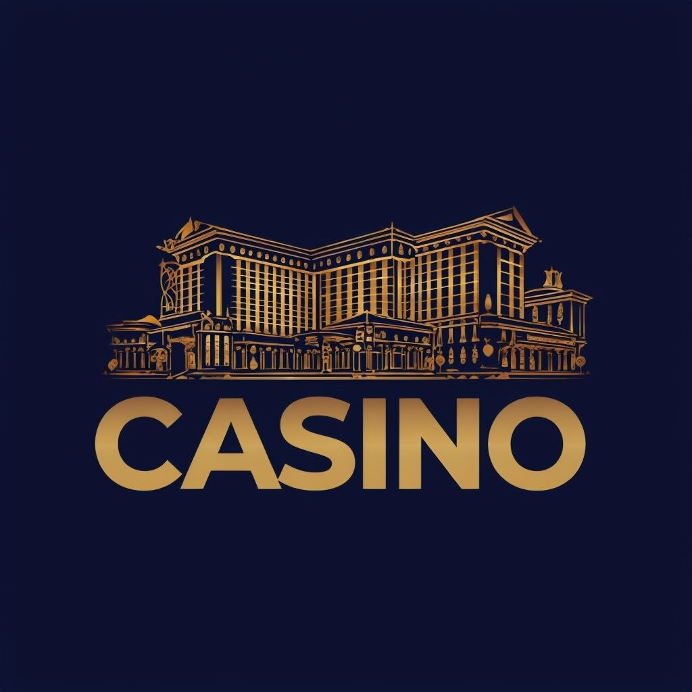

# The Tops Casino - Casino Simulation

As a product of an IT class project about software development, The Tops Casino was built to be a Casino Simulator with a variety of games to play.

The Name stems from "The Tops" Casino of Fallout: New Vegas

# LICENSE
Creative Commons CC0 1.0 Universal

Statement of Purpose:

The person who associated a work with this deed has dedicated the work to the public domain by waiving all of his or her rights to the work under copyright law, including all related and neighboring rights, to the extent allowed by law.

You should have received a copy of the CC0 legal code along with this work. If not, see <https://creativecommons.org/publicdomain/zero/1.0/>.

